# Inter Commerce App


App móvil de e-commerce en Flutter, sobre la API pública de [DummyJSON](https://dummyjson.com/products). Catálogo con scroll infinito y filtro por categoría, búsqueda, detalle de producto y carrito de compras persistente, con soporte offline para el contenido previamente cargado.

| Repo | Contenido |
|---|---|
| [`inter_commerce_app`](https://github.com/cgarzon1/inter_commerce_app) | La app (este repo) |
| [`inter_commerce_app_design_system`](https://github.com/cgarzon1/inter_commerce_app_design_system) | Tokens, tema y componentes UI, como paquete Flutter aparte |

APK de release firmado, disponible en [GitHub Releases](https://github.com/cgarzon1/inter_commerce_app/releases).

## Contenido

- [Demo](#demo)
- [Conventional Commits](#conventional-commits)
- [Design system](#design-system)
- [Arquitectura](#arquitectura)
- [Inyección de dependencias](#inyección-de-dependencias)
- [Offline](#offline)
- [Stack](#stack)
- [Cómo correr el proyecto](#cómo-correr-el-proyecto)
- [Tests](#tests)

## Demo

| | |
|---|---|
| 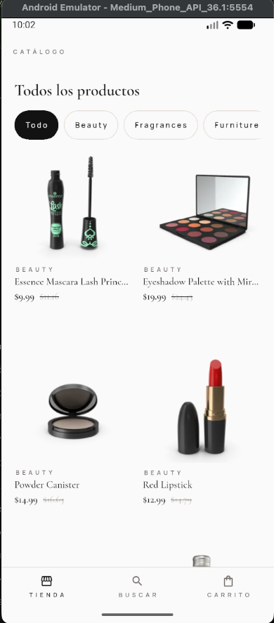 | 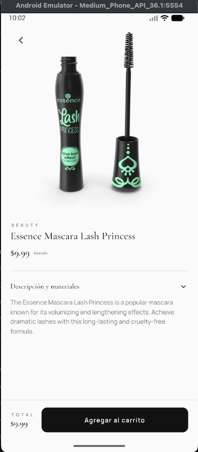 |
| 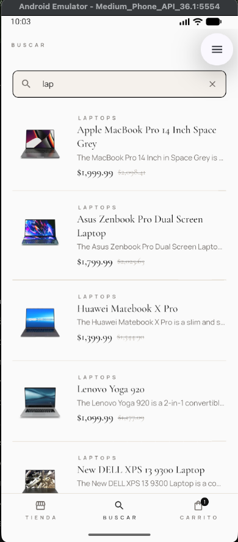 | 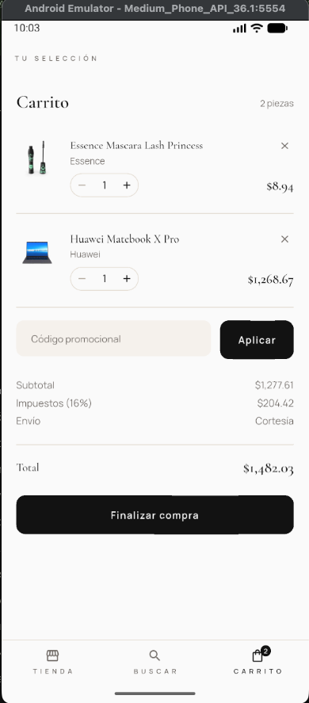 |
| 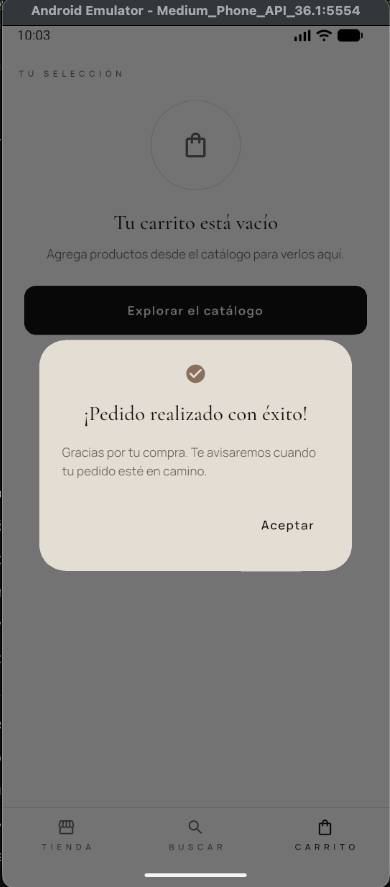 | |

## Conventional Commits

Commits en formato [Conventional Commits](https://www.conventionalcommits.org/), forzado por un git hook local (`bin/git_hooks.dart`, se instala solo con `flutter pub get`). Tipos permitidos: `feat`, `fix`, `refactor`, `docs`, `style`, `test`, `perf`, `chore`.

Un commit que no cumple el formato se rechaza antes de crearse:

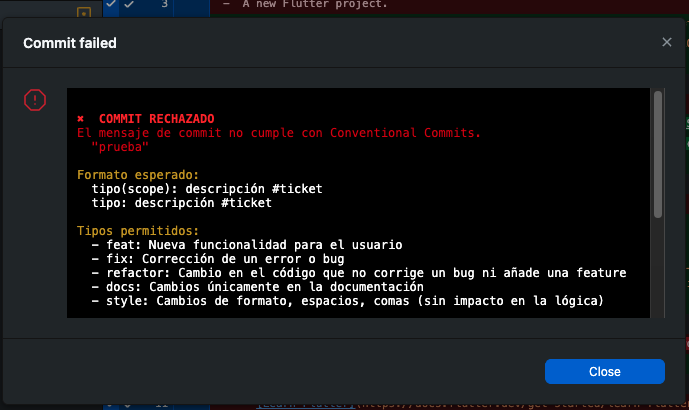

`bin/cz.dart` genera el mensaje de forma interactiva a partir de un cuestionario (tipo, scope, descripción y ticket opcional), evitando errores de formato manual:

```bash
fvm dart run bin/cz.dart
```

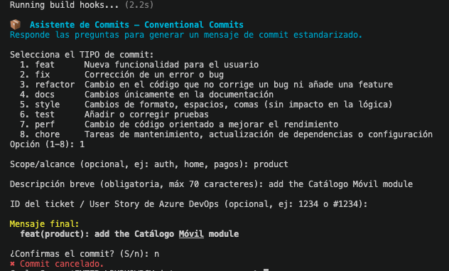

## Design system

El sistema de diseño ([`inter_commerce_app_design_system`](https://github.com/cgarzon1/inter_commerce_app_design_system)) es un paquete Flutter independiente de este repositorio, referenciado hoy como dependencia local por path. Concentra los tokens de diseño (color, tipografía, espaciado), el tema (`InterCommerceTheme`) y los componentes visuales que consume la capa de presentación de cada feature. Se implementó como paquete separado, en vez de como una carpeta de widgets dentro de la app, para que la definición visual del producto no quede atada a la estructura interna de una aplicación puntual.

La idea detrás de un sistema de diseño en un proyecto de software es esa: en lugar de que cada pantalla resuelva por su cuenta cómo se ve un botón, una tarjeta de producto o un espaciado, existe un único lugar donde esas decisiones se definen una vez y se consumen desde ahí. Si el tema cambia, cambia en un solo punto y se propaga a todo lo que lo consume, en vez de tener que replicarse pantalla por pantalla.

El paquete sigue Atomic Design para organizar esa jerarquía: los tokens (`foundations/`) alimentan los átomos, los átomos se combinan en moléculas, y las moléculas en organismos — cada nivel construido únicamente a partir del nivel anterior, nunca al revés.

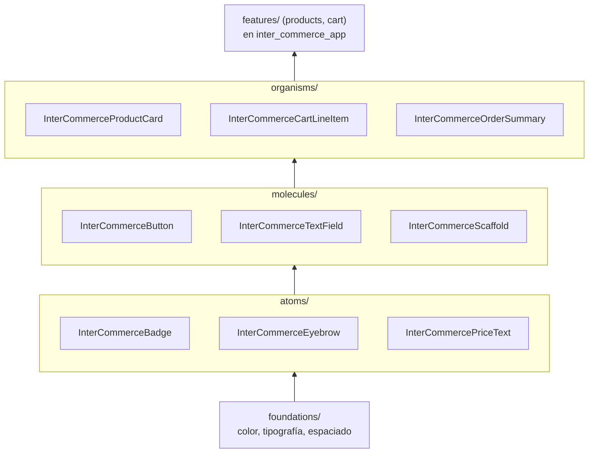

## Arquitectura

Clean Architecture, feature-first. Cada feature vive en `lib/features/<nombre>/` con tres capas:

```
lib/features/<feature>/
├── domain/          entidades, contrato del repositorio, casos de uso — Dart puro
├── data/             modelos, datasources (remoto/local), implementación del repositorio
└── presentation/     cubits, páginas, widgets
```

La dependencia siempre apunta hacia adentro, hacia `domain`. `data` implementa la interfaz de repositorio que `domain` define — nunca al revés:

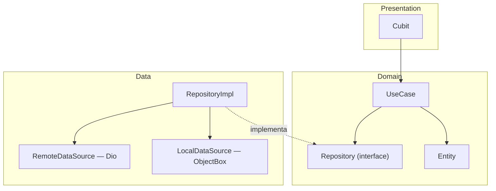

**Domain** no depende de Flutter, Dio ni ObjectBox. Un caso de uso (`GetProducts`, `AddCartItem`, `SearchProducts`...) recibe un objeto de parámetros, invoca una interfaz de repositorio abstracta y devuelve `Either<Failure, T>` (con `fpdart`). Al ser Dart puro, su costo de prueba es mínimo: no requiere inicializar Flutter ni mockear componentes distintos al repositorio.

**Data** implementa esas interfaces. El repositorio no depende directamente de Dio ni de ObjectBox — delega en datasources (`ProductRemoteDataSource`, `ProductLocalDataSource`) y, en esa frontera, convierte cualquier excepción (`ServerException`, `CacheException`) en el `Failure` correspondiente (`ServerFailure`, `CacheFailure`, `NetworkFailure`, `ValidationFailure`). Por encima de esa capa no se propaga ninguna excepción sin traducir.

**Presentation** son Cubits (`flutter_bloc`) que dependen únicamente de casos de uso, nunca de un repositorio directo. Cada pantalla instancia su propio Cubit vía `get_it` (`registerFactory`), con una excepción: `CartCubit` es un singleton provisto una única vez en `main.dart`, dado que el badge del carrito y su estado se comparten entre el catálogo, el detalle de producto y la pantalla del carrito.

Regla de dependencia entre features: `cart` puede importar la entidad `Product` de `products/domain` (necesita conocer qué está agregando), pero no a la inversa, y ninguno de los dos debería depender de la capa de datos o presentación del otro. Actualmente existe una excepción a esta última regla: `ProductDetailPage` referencia `CartCubit` directamente para el botón "Agregar al carrito". La solución correcta sería inyectar un callback desde el punto donde se hace el push de la pantalla, en vez de importar el cubit de otro feature — se documenta como deuda técnica conocida, pendiente de resolución.

## Inyección de dependencias

No se utiliza `injectable` ni generación de código para el DI — el registro con `get_it` se hace de forma manual en `lib/core/DI/injection_container.dart`, agrupado por feature y en orden de capas (datasource → repositorio → casos de uso → presentación). Al concentrarse en un único archivo, permite una auditoría completa del grafo de dependencias.

## Offline

Los productos y sus imágenes se cachean localmente con ObjectBox (`lib/features/products/data/entities/`) y `cached_network_image`. El repositorio prioriza la red; si la solicitud falla o no hay conexión, sirve el último dato cacheado y marca `isFromCache: true` en la respuesta, valor que el Cubit traduce a un flag `isOffline` para mostrar el aviso correspondiente en pantalla. El carrito se persiste íntegramente en ObjectBox — no depende de conectividad en ningún punto de su flujo.

## Stack

| Paquete | Para qué |
|---|---|
| `flutter_bloc` | Cubits, manejo de estado |
| `get_it` | Inyección de dependencias manual |
| `fpdart` | `Either<Failure, T>` en el retorno de repos/casos de uso |
| `dio` | Cliente HTTP hacia DummyJSON |
| `objectbox` | Persistencia local (cache de productos, carrito) |
| `cached_network_image` | Cache en disco de imágenes de producto |
| `connectivity_plus` | Detección de conectividad para el fallback offline |
| `mocktail` / `bloc_test` | Tests unitarios |

## Cómo correr el proyecto

La versión de Flutter está fijada mediante `fvm` (ver `.fvmrc`); todos los comandos deben ejecutarse con `fvm flutter`, no con el binario global.

```bash
fvm flutter pub get
cp .env.example .env   # variables por flavor, ver el propio archivo
fvm flutter run --dart-define=FLAVOR=dev
```

`FLAVOR` acepta `dev` o `qa`. Ambos apuntan actualmente al mismo backend público de DummyJSON; se diferenciarán si los entornos requieren backends distintos.

## Tests

```bash
fvm flutter test test/features/products/          # use cases + CatalogCubit
fvm flutter test test/features/products/ --coverage
```

Los tests unitarios usan `mocktail` para simular repositorios y casos de uso, y `bloc_test` para verificar las secuencias de estado de los Cubits, sin dependencias de red ni de Flutter widgets. Cobertura actual: casos de uso de `products` y `CatalogCubit`. `ProductDetailCubit`, `SearchCubit` y el feature `cart` no cuentan aún con tests unitarios propios.

El comando `--coverage` genera `coverage/lcov.info`, convertible a un reporte HTML navegable con `genhtml coverage/lcov.info -o coverage/html`. El 11.6% de la vista general corresponde a todo `lib/` (incluye pantallas y widgets sin test); al entrar a un directorio con cobertura real, como `lib/features/products/domain/entities/`, el número sube a 92.3%:

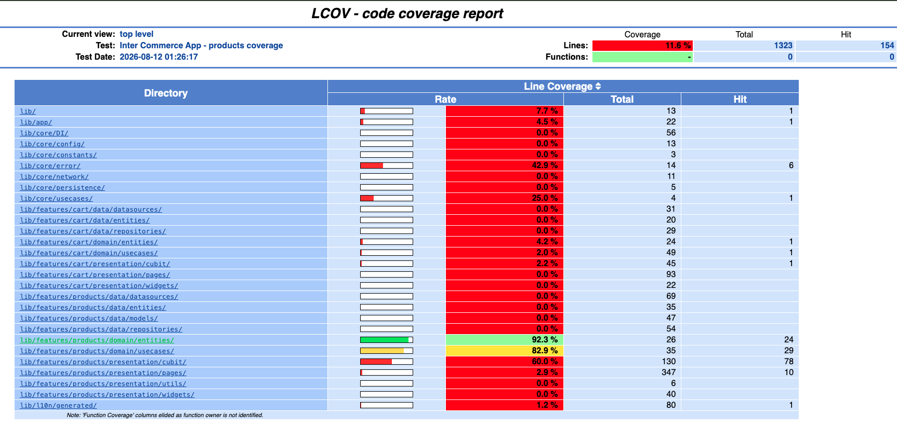

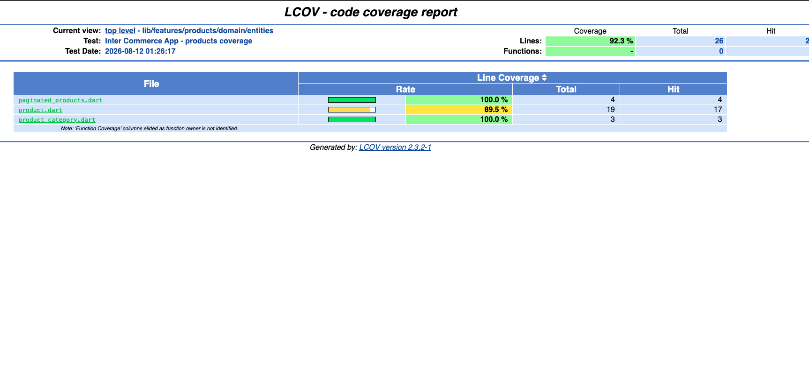
